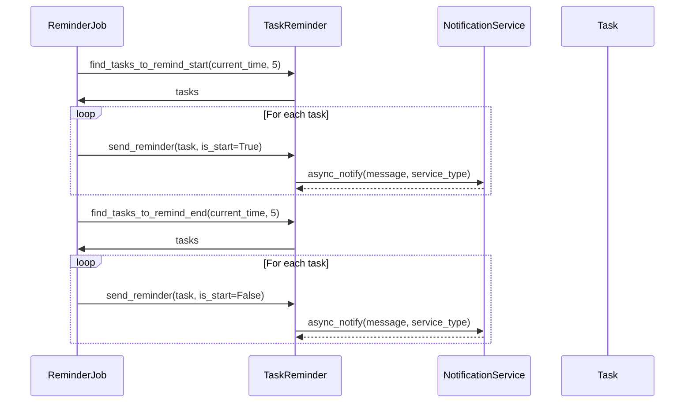
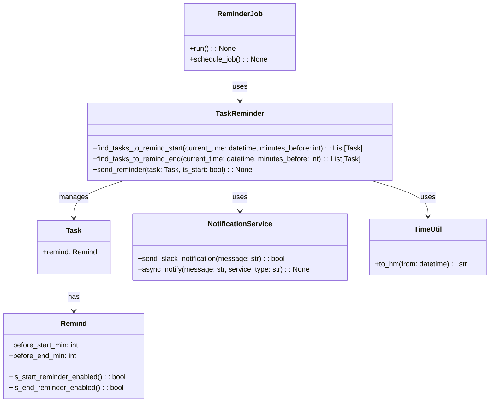

# Issue`762`の仕様書

## 変更履歴
- 2025/5/14: 初版作成(変更者: GitHub Copilot)
- 2025/5/14: 通知方法`Line`の削除(変更者: ユーザ)
  - 通知方法は、Slackに統一するため`Line`を削除しました。
- 2025/5/14: 記載例の削除(変更者: ユーザ)
  - 記載例は、必要ないため削除しました。
- 2025/5/14: Rimindクラスの追加(変更者: GitHub Copilot)
  - ユーザからの要望を受けて、リマインド属性をラッピングするRimindクラスを追加しました。

## 用語
- notiontaskr: 本プロジェクトの名称
- リマインド: タスクの開始時刻や終了時刻の前に通知を行うこと

## 依頼内容
- issue番号: 762
- タイトル: タスクリマインド機能の実装
- 内容: 
  - 選択期間のタグのタスクの開始にリマインドを設定
  - もしくは、選択したIDのタスクに全てリマインドを設定
  - タスクの属性に「開始n分前通知」「終了n分前通知」を追加
  - デフォルトの通知タイミング=開始5分前、終了5分前
  - Util:to_hm(from: datetime)の作成

## 機能要件/非機能要件
### 機能要件
- 選択した期間内のタグ付きタスクの開始時刻にリマインドを設定できること
- 選択したIDのタスク全てにリマインドを設定できること
- タスクの属性に「開始n分前通知」「終了n分前通知」を追加できること
- デフォルトの通知タイミングは開始5分前、終了5分前であること
- Slackでリマインドを送信できること

### 非機能要件
- 1分間隔の定期実行で、タスクの開始5分前のタスクをすべて回収できること
- 回収したタスクの通知をSlackに非同期で送信できること
- 通知処理は安定して動作し、エラーが発生してもログに記録されること

## 使用ツール/ライブラリ
- Slack API (Slackへの通知用)
- notionたskrの既存機能
- asyncio (非同期処理用)

## 7. タスクの名前に関するルールの追加
### 7.1. 現在のルール
- タスクの名前は、以下の形式であること
  - `[ID] タスク名 [⏱️人時] [親ID]` 
- 各ラベルは、以下の形式であること
  - `[key-value]`
  - keyには、絵文字や漢字一文字を使用している
  - valueには自由形式の文字列を使用している

### 7.2. 追加ルール
- 新規ラベルで通知用ラベルの作成
- 通知用ラベルはユーザ自身がNotion カレンダー上で直接設定する。
- 通知用ラベルは、以下の形式であること
  - key: 🔔
  - value: 5m(10mなどの分数)

## 8. クラス設計
### 8.1. `Remind`クラス(新規)
#### メンバ:
- `before_start_min: int`
  - 説明: 開始n分前に通知を行うための設定値
- `before_end_min: int`
  - 説明: 終了n分前に通知を行うための設定値

#### メソッド:
- `is_start_reminder_enabled() -> bool`
  - 説明: 
    - 開始リマインドが有効かどうかを判定する
    - `before_start_min`が0より大きい場合にTrueを返す
- `is_end_reminder_enabled() -> bool`
  - 説明: 
    - 終了リマインドが有効かどうかを判定する
    - `before_end_min`が0より大きい場合にTrueを返す

### 8.2. `Task`クラス(既存)の拡張
#### メンバ: 
- `remind: Remind`
  - 説明: リマインド設定を保持するオブジェクト

#### メソッド
  - `from_response`
    - 新規ラベル`通知ラベル`に対応するように修正(TaskNameクラスの修正等)

### 8.3. `TaskReminder`クラス(新規)
#### 説明:
- タスクのリマインドを管理するクラス
- タスクの開始時刻や終了時刻に基づいて、リマインド対象のタスクを抽出する
#### メソッド: 
- `find_tasks_to_remind_start(current_time: datetime, minutes_before: int = 5) -> List[Task]`
  - 説明: 現在時刻から指定分数後に開始するタスクを抽出する
- `find_tasks_to_remind_end(current_time: datetime, minutes_before: int = 5) -> List[Task]`
  - 説明: 現在時刻から指定分数後に終了するタスクを抽出する
- `send_reminder(task: Task, is_start: bool) -> None`
  - 説明: タスクのリマインドを送信する

### 8.4. `Notifier`インターフェース(新規)
#### 説明:
- 通知サービスのインターフェース
- 今後、Lineなど他の通知サービスを追加する際に利用する

#### メソッド:
- `async notify(message: str) -> bool`
  - 説明: 通知を送信するメソッド
  - 引数:
    - `message`: 通知メッセージ
  - 戻り値:
    - 成功した場合はTrue、失敗した場合はFalse

### 8.5. `SlackNotifier(Notifier)`クラス(新規)
#### 説明:
- Slack通知サービスの実装
- `Notifier`インターフェースを実装したSlack通知サービス

#### メソッド: 
- `async notify(message: str) -> bool`
  - 説明: Slackに通知を送信する

### `ReminderJob`クラス(新規)
#### メソッド: 
- `run() -> None`
  - 説明: リマインド対象のタスクを抽出し、通知を送信する
- `schedule_job() -> None`
  - 説明: 1分間隔でrunメソッドを実行するようにスケジュールする

### `TimeUtil`クラス(新規)
#### メソッド: 
- `to_hm(from: datetime) -> str`
  - 説明: 日時オブジェクトから時刻（HH:MM形式）を取得する

#### テストケース
- 正常系:
  - `find_tasks_to_remind_start`メソッドの正常系テスト
    - 入力: 現在時刻, 通知分数前
    - 期待値: 通知対象のタスクリスト
  - `find_tasks_to_remind_end`メソッドの正常系テスト
    - 入力: 現在時刻, 通知分数前
    - 期待値: 通知対象のタスクリスト
  - `send_reminder`メソッドの正常系テスト
    - 入力: タスク, 開始/終了フラグ
    - 期待値: なし（通知が送信されること）
  - `to_hm`メソッドの正常系テスト
    - 入力: datetime.datetime(2025, 5, 14, 12, 30)
    - 期待値: "12:30"
- 異常系:
  - 通知サービスが利用できない場合のエラーハンドリングテスト
    - 入力: 通知送信処理
    - 期待値: エラーログが記録され、例外がキャッチされること

## UML
### シーケンス図

### クラス図

## タスク
- [ ] タスクリマインド機能の実装(12h)
  - [ ] Remindドメインオブジェクトの実装(2h)
    - Remind.before_start_min属性およびbefore_end_min属性の実装
    - Remind.is_start_reminder_enabled()メソッドの実装
    - Remind.is_end_reminder_enabled()メソッドの実装
  - [ ] タスク属性拡張の実装(2h)
    - TaskクラスにTask.remind属性を追加
    - タスク作成/更新時にリマインド設定をデフォルト値（開始5分前、終了5分前）で初期化
  - [ ] リマインド対象タスク抽出ロジックの実装(3h)
    - TaskReminder.find_tasks_to_remind_start(current_time, minutes_before)の実装
    - TaskReminder.find_tasks_to_remind_end(current_time, minutes_before)の実装
    - 期間指定でのタスク抽出機能の拡張（タグによるフィルタリング）
  - [ ] 通知サービスの実装(3h)
    - NotificationService.send_slack_notification(message)の実装
    - NotificationService.async_notify(message, service_type)の実装
    - エラーハンドリングとログ記録機能の実装
  - [ ] 定期実行ジョブの実装(3h)
    - ReminderJob.run()メソッドの実装
    - ReminderJob.schedule_job()メソッドの実装
  - [ ] ユーティリティ関数の実装(1h)
    - TimeUtil.to_hm(from)関数の実装

