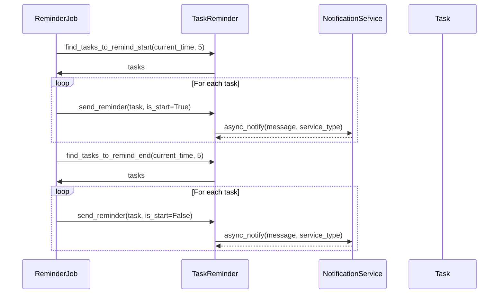
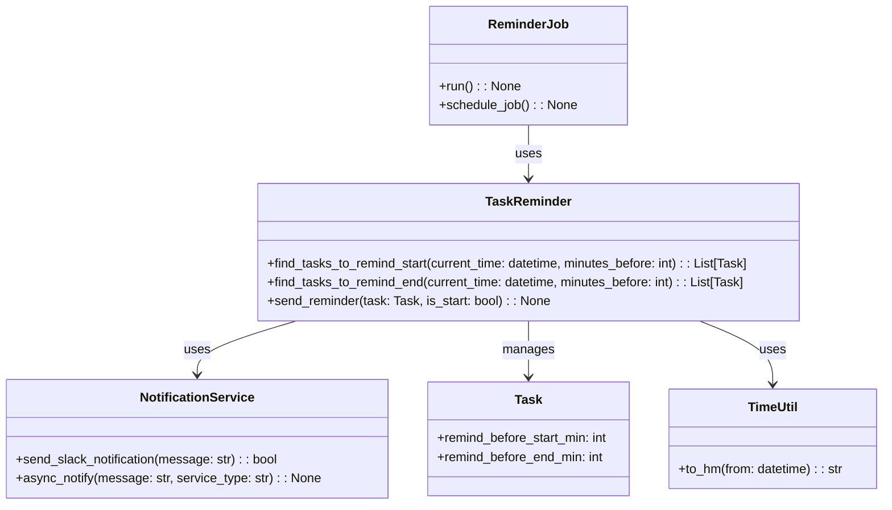

# Issue`762`の仕様書

## 変更履歴
- 2025/5/14: 初版作成(変更者: GitHub Copilot)
- 2025/5/14: 通知方法`Line`の削除(変更者: ユーザ)
  - 通知方法は、Slackに統一するため`Line`を削除しました。

## 用語
- notiontaskr: 本プロジェクトの名称
- リマインド: タスクの開始時刻や終了時刻の前に通知を行うこと

## 依頼内容
- issue番号: 762
- タイトル: タスクリマインド機能の実装
- 内容: 
  - 選択期間のタグのタスクの開始にリマインドを設定
  - もしくは、選択したIDのタスクに全てリマインドを設定
  - タスクの属性に「開始n分前通知」「終了n分前通知」を追加
  - デフォルトの通知タイミング=開始5分前、終了5分前
  - Util:to_hm(from: datetime)の作成

## 機能要件/非機能要件
### 機能要件
- 選択した期間内のタグ付きタスクの開始時刻にリマインドを設定できること
- 選択したIDのタスク全てにリマインドを設定できること
- タスクの属性に「開始n分前通知」「終了n分前通知」を追加できること
- デフォルトの通知タイミングは開始5分前、終了5分前であること
- Slackでリマインドを送信できること

### 非機能要件
- 1分間隔の定期実行で、タスクの開始5分前のタスクをすべて回収できること
- 回収したタスクの通知をSlackに非同期で送信できること
- 通知処理は安定して動作し、エラーが発生してもログに記録されること

## 使用ツール/ライブラリ
- Slack API (Slackへの通知用)
- notionたskrの既存機能
- asyncio (非同期処理用)

## クラス設計
### `Task`クラス(既存)の拡張
#### メンバ: 
- `remind_before_start_min: int`
  - 説明: 開始n分前に通知を行うための設定値
- `remind_before_end_min: int`
  - 説明: 終了n分前に通知を行うための設定値

### `TaskReminder`クラス(新規)
#### メソッド: 
- `find_tasks_to_remind_start(current_time: datetime, minutes_before: int = 5) -> List[Task]`
  - 説明: 現在時刻から指定分数後に開始するタスクを抽出する
- `find_tasks_to_remind_end(current_time: datetime, minutes_before: int = 5) -> List[Task]`
  - 説明: 現在時刻から指定分数後に終了するタスクを抽出する
- `send_reminder(task: Task, is_start: bool) -> None`
  - 説明: タスクのリマインドを送信する

### `NotificationService`クラス(新規)
#### メソッド: 
- `send_slack_notification(message: str) -> bool`
  - 説明: Slackに通知を送信する
- `async_notify(message: str, service_type: str) -> None`
  - 説明: 非同期で通知を送信する

### `ReminderJob`クラス(新規)
#### メソッド: 
- `run() -> None`
  - 説明: リマインド対象のタスクを抽出し、通知を送信する
- `schedule_job() -> None`
  - 説明: 1分間隔でrunメソッドを実行するようにスケジュールする

### `TimeUtil`クラス(新規)
#### メソッド: 
- `to_hm(from: datetime) -> str`
  - 説明: 日時オブジェクトから時刻（HH:MM形式）を取得する

#### テストケース
- 正常系:
  - `find_tasks_to_remind_start`メソッドの正常系テスト
    - 入力: 現在時刻, 通知分数前
    - 期待値: 通知対象のタスクリスト
  - `find_tasks_to_remind_end`メソッドの正常系テスト
    - 入力: 現在時刻, 通知分数前
    - 期待値: 通知対象のタスクリスト
  - `send_reminder`メソッドの正常系テスト
    - 入力: タスク, 開始/終了フラグ
    - 期待値: なし（通知が送信されること）
  - `to_hm`メソッドの正常系テスト
    - 入力: datetime.datetime(2025, 5, 14, 12, 30)
    - 期待値: "12:30"
- 異常系:
  - 通知サービスが利用できない場合のエラーハンドリングテスト
    - 入力: 通知送信処理
    - 期待値: エラーログが記録され、例外がキャッチされること

## UML
### シーケンス図

### クラス図

## タスク
- [ ] タスクリマインド機能の実装(12h)
  - [ ] タスク属性拡張の実装(2h)
    - Taskクラスにremind_before_start_min属性（開始n分前通知）を追加
    - Taskクラスにremind_before_end_min属性（終了n分前通知）を追加
    - タスク作成/更新時にリマインド設定をデフォルト値（開始5分前、終了5分前）で初期化
  - [ ] リマインド対象タスク抽出ロジックの実装(3h)
    - 現在時刻から指定分数後（デフォルト5分後）に開始するタスクを抽出する機能の実装
    - 現在時刻から指定分数後（デフォルト5分後）に終了するタスクを抽出する機能の実装
    - 期間指定でのタスク抽出機能の拡張（タグによるフィルタリング）
  - [ ] 通知サービスの実装(3h)
    - Slackに通知を送信するサービスの実装
    - 非同期処理での通知機能の実装
    - エラーハンドリングとログ記録機能の実装
  - [ ] 定期実行ジョブの実装(3h)
    - 1分間隔でのリマインド対象タスク抽出と通知実行機能の実装
    - ジョブのスケジュール設定と実行管理機能の実装
  - [ ] ユーティリティ関数の実装(1h)
    - to_hm(from: datetime)関数の実装：日時オブジェクトから時刻（HH:MM形式）を取得する機能
  - タスクの内容
  - タスクの人時工数(例: 1h)
    - 人時工数は、あくまで目安であり、推測されるコーディング量などから算出してください。 
- メインタスクには、主に以下の内容を記載します。
  - 依頼内容の要件を大まかに分解したもの
  - 分解はこの段階では細かくしすぎないこと
  - (例: -[ ] 〇〇機能の実装(1h))
- サブタスクには、主に以下の内容を記載します。
  - メインタスクをより細かく分解したもの
  - クラスやメソッド実装のレベルまで分解する
  - (例: -[ ] 〇〇クラスの実装(1h))
- 実装内容には、自由形式でクラス内部のメンバやメソッドについて記載します。
  - (例: -[ ] 〇〇メソッドの実装(1h))
    - xxをおこなうxxメソッドを実装する
    - メンバにはxxやxxを実装する
    - xxインターフェースを継承する

#### 記載例(作成時には削除してください)
- [ ] 〇〇機能の実装(1h)
  - [ ] 〇〇クラスの実装(1h)
    - 〇〇クラスを実装する
    - メンバには、〇〇や〇〇を実装する
    - 〇〇インターフェースを継承する

