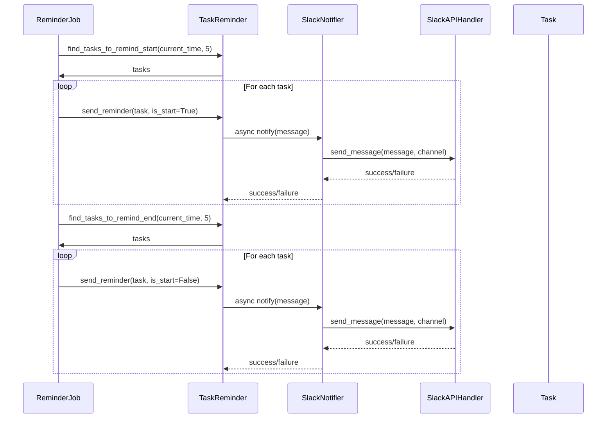
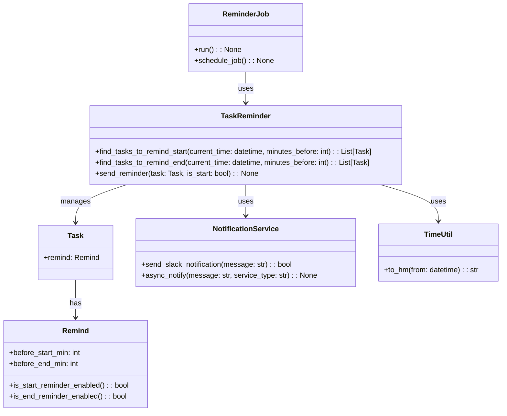

# Issue`762`ã®ä»•æ§˜æ›¸

## 1. 目次
- [1. 目次](#1-目次)
- [2. 用èª](#2-用èª)
- [3. ä¾é ¼å†…容](#3-ä¾é ¼å†…容)
- [4. 機能è¦ä»¶/é機能è¦ä»¶](#4-機能è¦ä»¶é機能è¦ä»¶)
  - [4.1. 機能è¦ä»¶](#41-機能è¦ä»¶)
  - [4.2. é機能è¦ä»¶](#42-é機能è¦ä»¶)
- [5. 使用ツール/ライブラリ](#5-使用ツールライブラリ)
- [6. タスクã®åå‰ã«é–¢ã™ã‚‹ãƒ«ãƒ¼ãƒ«ã®è¿½åŠ ](#6-タスクã®åå‰ã«é–¢ã™ã‚‹ãƒ«ãƒ¼ãƒ«ã®è¿½åŠ )
  - [6.1. ç¾åœ¨ã®ãƒ«ãƒ¼ãƒ«](#61-ç¾åœ¨ã®ãƒ«ãƒ¼ãƒ«)
  - [6.2. 追加ルール](#62-追加ルール)
- [7. クラス設計](#7-クラス設計)
  - [7.1. `Remind`クラス(æ–°è¦)](#71-remindクラス新è¦)
  - [7.2. `ExecutedTask`クラス(既存)ã®æ‹¡å¼µ](#72-executedtaskクラス既存ã®æ‹¡å¼µ)
  - [7.3. `ExecutedTaskService`クラス(既存)](#73-executedtaskserviceクラス既存)
  - [7.4. `Notifier`インターフェース(æ–°è¦)](#74-notifierインターフェース新è¦)
  - [7.5. `SlackNotifier(Notifier)`クラス(æ–°è¦)](#75-slacknotifiernotifierクラス新è¦)
  - [7.6. `SlackAPIHandler`クラス(æ–°è¦)](#76-slackapihandlerクラス新è¦)
  - [7.7. `TimeUtil`クラス(æ–°è¦)](#77-timeutilクラス新è¦)
- [8. UML](#8-uml)
  - [8.1. シーケンス図](#81-シーケンス図)
  - [8.2. クラス図](#82-クラス図)
- [9. タスク](#9-タスク)

## 2. 用èª
- notiontaskr: 本プロジェクトã®å称
- リãƒã‚¤ãƒ³ãƒ‰: タスクã®é–‹å§‹æ™‚刻や終了時刻ã®å‰ã«é€šçŸ¥ã‚’è¡Œã†ã“ã¨

## 3. ä¾é ¼å†…容
- issue番å·: 762
- タイトル: タスクリãƒã‚¤ãƒ³ãƒ‰æ©Ÿèƒ½ã®å®Ÿè£…
- 内容: 
  - é¸æŠæœŸé–“ã®ã‚¿ã‚°ã®ã‚¿ã‚¹ã‚¯ã®é–‹å§‹ã«ãƒªãƒã‚¤ãƒ³ãƒ‰ã‚’設定
  - ã‚‚ã—ãã¯ã€é¸æŠã—ãŸIDã®ã‚¿ã‚¹ã‚¯ã«å…¨ã¦ãƒªãƒã‚¤ãƒ³ãƒ‰ã‚’設定
  - タスクã®å±æ€§ã«ã€Œé–‹å§‹n分å‰é€šçŸ¥ã€ã€Œçµ‚了n分å‰é€šçŸ¥ã€ã‚’追加
  - デフォルトã®é€šçŸ¥ã‚¿ã‚¤ãƒŸãƒ³ã‚°=開始5分å‰ã€çµ‚了5分å‰
  - Util:to_hm(from: datetime)ã®ä½œæˆ

## 4. 機能è¦ä»¶/é機能è¦ä»¶
### 4.1. 機能è¦ä»¶
- é¸æŠã—ãŸæœŸé–“内ã®ã‚¿ã‚°ä»˜ãタスクã®é–‹å§‹æ™‚刻ã«ãƒªãƒã‚¤ãƒ³ãƒ‰ã‚’設定ã§ãã‚‹ã“ã¨
- é¸æŠã—ãŸIDã®ã‚¿ã‚¹ã‚¯å…¨ã¦ã«ãƒªãƒã‚¤ãƒ³ãƒ‰ã‚’設定ã§ãã‚‹ã“ã¨
- タスクã®å±æ€§ã«ã€Œé–‹å§‹n分å‰é€šçŸ¥ã€ã€Œçµ‚了n分å‰é€šçŸ¥ã€ã‚’追加ã§ãã‚‹ã“ã¨
- デフォルトã®é€šçŸ¥ã‚¿ã‚¤ãƒŸãƒ³ã‚°ã¯é–‹å§‹5分å‰ã€çµ‚了5分å‰ã§ã‚ã‚‹ã“ã¨
- Slackã§ãƒªãƒã‚¤ãƒ³ãƒ‰ã‚’é€ä¿¡ã§ãã‚‹ã“ã¨

### 4.2. é機能è¦ä»¶
- 1分間隔ã®å®šæœŸå®Ÿè¡Œã§ã€ã‚¿ã‚¹ã‚¯ã®é–‹å§‹5分å‰ã®ã‚¿ã‚¹ã‚¯ã‚’ã™ã¹ã¦å›åã§ãã‚‹ã“ã¨
- å›åã—ãŸã‚¿ã‚¹ã‚¯ã®é€šçŸ¥ã‚’Slackã«éåŒæœŸã§é€ä¿¡ã§ãã‚‹ã“ã¨
- 通知処ç†ã¯å®‰å®šã—ã¦å‹•ä½œã—ã€ã‚¨ãƒ©ãƒ¼ãŒç™ºç”Ÿã—ã¦ã‚‚ログã«è¨˜éŒ²ã•ã‚Œã‚‹ã“ã¨

## 5. 使用ツール/ライブラリ
- Slack API (Slackã¸ã®é€šçŸ¥ç”¨)
- notionãŸskrã®æ—¢å­˜æ©Ÿèƒ½
- asyncio (éåŒæœŸå‡¦ç†ç”¨)

## 6. タスクã®åå‰ã«é–¢ã™ã‚‹ãƒ«ãƒ¼ãƒ«ã®è¿½åŠ 
### 6.1. ç¾åœ¨ã®ãƒ«ãƒ¼ãƒ«
- タスクã®åå‰ã¯ã€ä»¥ä¸‹ã®å½¢å¼ã§ã‚ã‚‹ã“ã¨
  - `[ID] タスクå [â±ï¸äººæ™‚] [親ID]` 
- å„ラベルã¯ã€ä»¥ä¸‹ã®å½¢å¼ã§ã‚ã‚‹ã“ã¨
  - `[key-value]`
  - keyã«ã¯ã€çµµæ–‡å­—や漢字一文字を使用ã—ã¦ã„ã‚‹
  - valueã«ã¯è‡ªç”±å½¢å¼ã®æ–‡å­—列を使用ã—ã¦ã„ã‚‹

### 6.2. 追加ルール
- æ–°è¦ãƒ©ãƒ™ãƒ«ã§é€šçŸ¥ç”¨ãƒ©ãƒ™ãƒ«ã®ä½œæˆ
- 通知用ラベルã¯ãƒ¦ãƒ¼ã‚¶è‡ªèº«ãŒNotion カレンダー上ã§ç›´æ¥è¨­å®šã™ã‚‹ã€‚
- 通知用ラベルã¯ã€ä»¥ä¸‹ã®å½¢å¼ã§ã‚ã‚‹ã“ã¨
  - key: 🔔
  - value: 5m(10mãªã©ã®åˆ†æ•°)

## 7. クラス設計
### 7.1. `Remind`クラス(æ–°è¦)
#### メンãƒ:
- `before_start_min: int`
  - 説æ˜: 開始n分å‰ã«é€šçŸ¥ã‚’è¡Œã†ãŸã‚ã®è¨­å®šå€¤
- `before_end_min: int`
  - 説æ˜: 終了n分å‰ã«é€šçŸ¥ã‚’è¡Œã†ãŸã‚ã®è¨­å®šå€¤

#### メソッド:
- `is_start_reminder_enabled() -> bool`
  - 説æ˜: 
    - 開始リãƒã‚¤ãƒ³ãƒ‰ãŒæœ‰åŠ¹ã‹ã©ã†ã‹ã‚’判定ã™ã‚‹
    - `before_start_min`ãŒ0より大ãã„å ´åˆã«Trueã‚’è¿”ã™
- `is_end_reminder_enabled() -> bool`
  - 説æ˜: 
    - 終了リãƒã‚¤ãƒ³ãƒ‰ãŒæœ‰åŠ¹ã‹ã©ã†ã‹ã‚’判定ã™ã‚‹
    - `before_end_min`ãŒ0より大ãã„å ´åˆã«Trueã‚’è¿”ã™

### 7.2. `ExecutedTask`クラス(既存)ã®æ‹¡å¼µ
#### メンãƒ: 
- `remind: Remind`
  - 説æ˜: リãƒã‚¤ãƒ³ãƒ‰è¨­å®šã‚’ä¿æŒã™ã‚‹ã‚ªãƒ–ジェクト

#### メソッド
  - `from_response`(既存)
    - æ–°è¦ãƒ©ãƒ™ãƒ«`通知ラベル`ã«å¯¾å¿œã™ã‚‹ã‚ˆã†ã«ä¿®æ­£(TaskNameクラスã®ä¿®æ­£ç­‰)

### 7.3. `TaskReminder`クラス(æ–°è¦)
#### 説æ˜:
- タスクã®ãƒªãƒã‚¤ãƒ³ãƒ‰ã‚’管ç†ã™ã‚‹ã‚¯ãƒ©ã‚¹
- タスクã®é–‹å§‹æ™‚刻や終了時刻ã«åŸºã¥ã„ã¦ã€ãƒªãƒã‚¤ãƒ³ãƒ‰å¯¾è±¡ã®ã‚¿ã‚¹ã‚¯ã‚’抽出ã™ã‚‹
#### メソッド: 
- `find_tasks_to_remind_start(current_time: datetime, minutes_before: int = 5) -> List[Task]`
  - 説æ˜: ç¾åœ¨æ™‚刻ã‹ã‚‰æŒ‡å®šåˆ†æ•°å¾Œã«é–‹å§‹ã™ã‚‹ã‚¿ã‚¹ã‚¯ã‚’抽出ã™ã‚‹
- `find_tasks_to_remind_end(current_time: datetime, minutes_before: int = 5) -> List[Task]`
  - 説æ˜: ç¾åœ¨æ™‚刻ã‹ã‚‰æŒ‡å®šåˆ†æ•°å¾Œã«çµ‚了ã™ã‚‹ã‚¿ã‚¹ã‚¯ã‚’抽出ã™ã‚‹
- `send_reminder(task: Task, is_start: bool) -> None`
  - 説æ˜: タスクã®ãƒªãƒã‚¤ãƒ³ãƒ‰ã‚’é€ä¿¡ã™ã‚‹

### 7.4. `Notifier`インターフェース(æ–°è¦)
#### 説æ˜:
- 通知サービスã®ã‚¤ãƒ³ã‚¿ãƒ¼ãƒ•ã‚§ãƒ¼ã‚¹
- 今後ã€Lineãªã©ä»–ã®é€šçŸ¥ã‚µãƒ¼ãƒ“スを追加ã™ã‚‹éš›ã«åˆ©ç”¨ã™ã‚‹

#### メソッド:
- `async notify(message: str) -> bool`
  - 説æ˜: 通知をé€ä¿¡ã™ã‚‹ãƒ¡ã‚½ãƒƒãƒ‰
  - 引数:
    - `message`: 通知メッセージ
  - 戻り値:
    - æˆåŠŸã—ãŸå ´åˆã¯Trueã€å¤±æ•—ã—ãŸå ´åˆã¯False

### 7.5. `SlackNotifier(Notifier)`クラス(æ–°è¦)
#### 説æ˜:
- Slack通知サービスã®å®Ÿè£…
- `Notifier`インターフェースを実装ã—ãŸSlack通知サービス

#### メソッド: 
- `async notify(message: str) -> bool`
  - 説æ˜: Slackã«é€šçŸ¥ã‚’é€ä¿¡ã™ã‚‹

### 7.6. `SlackAPIHandler`クラス(æ–°è¦)
#### 説æ˜:
- Slack APIを利用ã™ã‚‹è²¬å‹™ã‚’æ‹…ã†ã‚¯ãƒ©ã‚¹
- 今å›ã¯é€šçŸ¥æ©Ÿèƒ½ã®ã¿å®Ÿè£…ã™ã‚‹ãŒã€å°†æ¥çš„ã«ä»–ã®API機能も追加å¯èƒ½
- Slack APIã«ã¤ã„ã¦ã¯ã€ä»¥ä¸‹ãƒ‰ã‚­ãƒ¥ãƒ¡ãƒ³ãƒˆã‚’å‚考
  - `docs/issues/issue-762/about-slack-api.md`

#### メソッド: 
- `run() -> None`
  - 説æ˜: リãƒã‚¤ãƒ³ãƒ‰å¯¾è±¡ã®ã‚¿ã‚¹ã‚¯ã‚’抽出ã—ã€é€šçŸ¥ã‚’é€ä¿¡ã™ã‚‹
- `schedule_job() -> None`
  - 説æ˜: 1分間隔ã§runメソッドを実行ã™ã‚‹ã‚ˆã†ã«ã‚¹ã‚±ã‚¸ãƒ¥ãƒ¼ãƒ«ã™ã‚‹

### 7.7. `TimeUtil`クラス(æ–°è¦)
#### メソッド: 
- `to_hm(from: datetime) -> str`
  - 説æ˜: 日時オブジェクトã‹ã‚‰æ™‚刻（HH:MMå½¢å¼ï¼‰ã‚’å–å¾—ã™ã‚‹

#### テストケース
- 正常系:
  - `find_tasks_to_remind_start`メソッドã®æ­£å¸¸ç³»ãƒ†ã‚¹ãƒˆ
    - 入力: ç¾åœ¨æ™‚刻, 通知分数å‰
    - 期待値: 通知対象ã®ã‚¿ã‚¹ã‚¯ãƒªã‚¹ãƒˆ
  - `find_tasks_to_remind_end`メソッドã®æ­£å¸¸ç³»ãƒ†ã‚¹ãƒˆ
    - 入力: ç¾åœ¨æ™‚刻, 通知分数å‰
    - 期待値: 通知対象ã®ã‚¿ã‚¹ã‚¯ãƒªã‚¹ãƒˆ
  - `send_reminder`メソッドã®æ­£å¸¸ç³»ãƒ†ã‚¹ãƒˆ
    - 入力: タスク, 開始/終了フラグ
    - 期待値: ãªã—（通知ãŒé€ä¿¡ã•ã‚Œã‚‹ã“ã¨ï¼‰
  - `to_hm`メソッドã®æ­£å¸¸ç³»ãƒ†ã‚¹ãƒˆ
    - 入力: datetime.datetime(2025, 5, 14, 12, 30)
    - 期待値: "12:30"
- 異常系:
  - 通知サービスãŒåˆ©ç”¨ã§ããªã„å ´åˆã®ã‚¨ãƒ©ãƒ¼ãƒãƒ³ãƒ‰ãƒªãƒ³ã‚°ãƒ†ã‚¹ãƒˆ
    - 入力: 通知é€ä¿¡å‡¦ç†
    - 期待値: エラーログãŒè¨˜éŒ²ã•ã‚Œã€ä¾‹å¤–ãŒã‚­ãƒ£ãƒƒãƒã•ã‚Œã‚‹ã“ã¨

## 8. UML
### 8.1. シーケンス図

```mermaid
sequenceDiagram
    participant Job as ReminderJob
    participant Reminder as TaskReminder
    participant Slack as SlackNotifier
    participant API as SlackAPIHandler
    participant Task
    
    Job->>Reminder: find_tasks_to_remind_start(current_time, 5)
    Reminder->>Job: tasks
    
    loop For each task
        Job->>Reminder: send_reminder(task, is_start=True)
        Reminder->>Slack: async notify(message)
        Slack->>API: send_message(message, channel)
        API-->>Slack: success/failure
        Slack-->>Reminder: success/failure
    end
    
    Job->>Reminder: find_tasks_to_remind_end(current_time, 5)
    Reminder->>Job: tasks
    
    loop For each task
        Job->>Reminder: send_reminder(task, is_start=False)
        Reminder->>Slack: async notify(message)
        Slack->>API: send_message(message, channel)
        API-->>Slack: success/failure
        Slack-->>Reminder: success/failure
    end
```
### 8.2. クラス図

```mermaid
classDiagram
    class Remind {
        +before_start_min: int
        +before_end_min: int
        +is_start_reminder_enabled(): bool
        +is_end_reminder_enabled(): bool
    }
    
    class Task {
        +remind: Remind
    }
    
    class TaskReminder {
        +find_tasks_to_remind_start(current_time: datetime, minutes_before: int): List[Task]
        +find_tasks_to_remind_end(current_time: datetime, minutes_before: int): List[Task]
        +send_reminder(task: Task, is_start: bool): None
    }
    
    class NotificationService {
        +send_slack_notification(message: str): bool
        +async_notify(message: str, service_type: str): None
    }
    
    class ReminderJob {
        +run(): None
        +schedule_job(): None
    }
    
    class TimeUtil {
        +to_hm(from: datetime): str
    }
    
    Task --> Remind: has
    ReminderJob --> TaskReminder: uses
    TaskReminder --> NotificationService: uses
    TaskReminder --> Task: manages
    TaskReminder --> TimeUtil: uses
```

## 9. タスク
- [ ] タスクリãƒã‚¤ãƒ³ãƒ‰æ©Ÿèƒ½ã®å®Ÿè£…(12h)
  - [ ] Remindドメインオブジェクトã®å®Ÿè£…(2h)
    - Remind.before_start_minå±æ€§ãŠã‚ˆã³before_end_minå±æ€§ã®å®Ÿè£…
    - Remind.is_start_reminder_enabled()メソッドã®å®Ÿè£…
    - Remind.is_end_reminder_enabled()メソッドã®å®Ÿè£…
  - [ ] タスクå±æ€§æ‹¡å¼µã®å®Ÿè£…(2h)
    - Taskクラスã«Task.remindå±æ€§ã‚’追加
    - タスク作æˆ/更新時ã«ãƒªãƒã‚¤ãƒ³ãƒ‰è¨­å®šã‚’デフォルト値（開始5分å‰ã€çµ‚了5分å‰ï¼‰ã§åˆæœŸåŒ–
  - [ ] リãƒã‚¤ãƒ³ãƒ‰å¯¾è±¡ã‚¿ã‚¹ã‚¯æŠ½å‡ºãƒ­ã‚¸ãƒƒã‚¯ã®å®Ÿè£…(3h)
    - TaskReminder.find_tasks_to_remind_start(current_time, minutes_before)ã®å®Ÿè£…
    - TaskReminder.find_tasks_to_remind_end(current_time, minutes_before)ã®å®Ÿè£…
    - 期間指定ã§ã®ã‚¿ã‚¹ã‚¯æŠ½å‡ºæ©Ÿèƒ½ã®æ‹¡å¼µï¼ˆã‚¿ã‚°ã«ã‚ˆã‚‹ãƒ•ã‚£ãƒ«ã‚¿ãƒªãƒ³ã‚°ï¼‰
  - [ ] 通知サービスã®å®Ÿè£…(3h)
    - NotificationService.send_slack_notification(message)ã®å®Ÿè£…
    - NotificationService.async_notify(message, service_type)ã®å®Ÿè£…
    - エラーãƒãƒ³ãƒ‰ãƒªãƒ³ã‚°ã¨ãƒ­ã‚°è¨˜éŒ²æ©Ÿèƒ½ã®å®Ÿè£…
  - [ ] 定期実行ジョブã®å®Ÿè£…(3h)
    - ReminderJob.run()メソッドã®å®Ÿè£…
    - ReminderJob.schedule_job()メソッドã®å®Ÿè£…
  - [ ] ユーティリティ関数ã®å®Ÿè£…(1h)
    - TimeUtil.to_hm(from)関数ã®å®Ÿè£…

