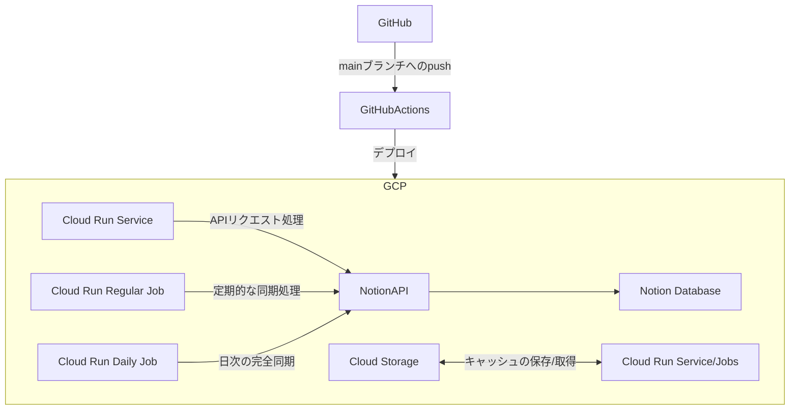
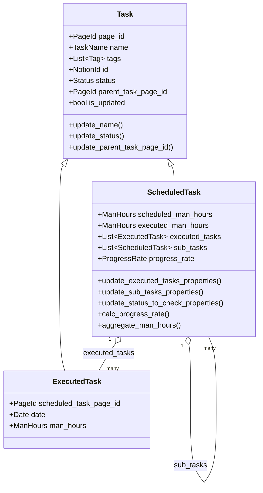

# notiontaskr仕様書

## 目次
- [目次](#目次)
- [概要](#概要)
- [GCP構成イメージ](#gcp構成イメージ)
- [Taskドメイン - クラス図](#taskドメイン---クラス図)

## 概要
- NotionのDBとNotionAPIを使用して、タスクの予実管理を行うシステム

## GCP構成イメージ

- アプリ本体はGCPのCloud Run上で動作(サービス/ジョブ)
- Cloud Runには1m間隔とデイリーで定期実行するJobがある
  - 1m間隔: 1m前までのタスクを取得し、変更があれば関連するタスクを更新
  - デイリー: 過去1年分のタスクを取得し、キャッシュ(pickle)に変換し、GCSに保存
- Cloud Runのサービスは現在使用していない。
- GCPの構成は以下図を参照してください。

## Taskドメイン - クラス図

- Notion DBから取得したデータは、主に`予定タスク`と`実績タスク`に分けられる
  - `予定タスク`: タスクの予定を示すデータ。予定タスクは内部に実績タスクのリストを持つ。
  - `実績タスク`: タスクの実績を示すデータ。
- タスクは、親タスクと子タスクの関係を持つことができる。
- タスクについての詳細は、以下のクラス図を参照してください。
  - ※クラスの内部構造は2025/5/15時点のものです。

