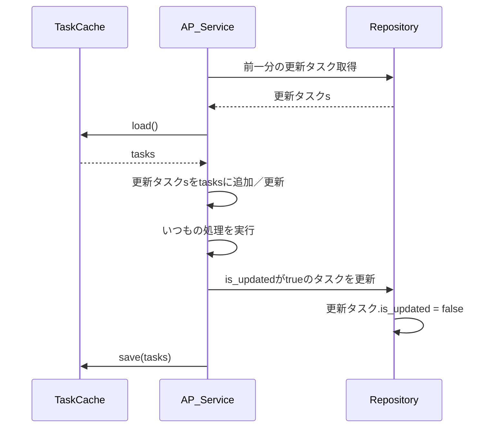

```mermaid
sequenceDiagram
    participant TaskCache
    participant AP_Service
    participant Repository

    AP_Service ->> Repository : 前一分の更新タスク取得
    Repository -->> AP_Service : 更新タスクs
    AP_Service ->> TaskCache : load()
    TaskCache -->> AP_Service : tasks
    AP_Service ->> AP_Service : 更新タスクsをtasksに追加／更新
    AP_Service ->> AP_Service : いつもの処理を実行
    AP_Service ->> Repository : is_updatedがtrueのタスクを更新
    Repository ->> Repository : 更新タスク.is_updated = false
    AP_Service ->> TaskCache : save(tasks)
```
